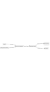

# Architecture Documentation

Este documento descreve a arquitetura do sistema, abordando tanto o fluxo de dados quanto a arquitetura em alto nível. O objetivo é fornecer uma visão clara sobre como os componentes do sistema interagem e como os dados fluem entre eles.

---

## **1. Introdução**
O sistema foi projetado para suportar aplicações de IA utilizando o Flowise, garantindo escalabilidade, alta disponibilidade e segurança. A arquitetura se baseia em serviços da AWS como EKS, RDS PostgreSQL, S3 e WAF.

---

## **2. Arquitetura de Alto Nível**
A arquitetura de alto nível inclui os seguintes componentes principais:

1. **Usuários**:
   - Interagem com o sistema através de uma interface API ou UI.

2. **VPC**:
   - Rede virtual configurada com sub-redes públicas e privadas.

3. **EKS (Kubernetes)**:
   - Orquestra contêineres para a aplicação Flowise e outros serviços.

4. **RDS PostgreSQL**:
   - Banco de dados gerenciado para armazenar dados da aplicação.

5. **S3**:
   - Armazena artefatos, backups e modelos de IA.

6. **WAF (Web Application Firewall)**:
   - Protege contra ameaças comuns, como ataques de bots e injeções SQL.

7. **ALB (Application Load Balancer)**:
   - Distribui o tráfego entre os pods do cluster EKS.

---

### **Mermaid: Arquitetura de Alto Nível**

---

## **3. Fluxo de Dados**
O fluxo de dados no sistema segue o seguinte caminho:

1. **Entrada do Usuário**:
   - Solicitações chegam ao sistema através do ALB.

2. **Processamento**:
   - O ALB direciona o tráfego para o cluster EKS.
   - Dentro do EKS, os pods processam os dados e interagem com o banco RDS para salvar informações ou buscar dados.

3. **Armazenamento de Artefatos**:
   - Dados processados, modelos de IA e backups são armazenados no S3.

4. **Segurança**:
   - O WAF filtra o tráfego antes de atingir o ALB para proteger contra ataques.

---

### **Mermaid: Fluxo de Dados**

---

## **4. Considerações de Design**

### **4.1. Alta Disponibilidade**
- O sistema utiliza múltiplas zonas de disponibilidade para o cluster EKS e o RDS, garantindo alta disponibilidade e redundância.

### **4.2. Escalabilidade**
- O HPA (Horizontal Pod Autoscaler) ajusta automaticamente o número de pods com base no uso de CPU e memória.

### **4.3. Segurança**
- O WAF protege contra ameaças comuns.
- Dados no S3 são criptografados.
- O acesso ao RDS é restrito a partir de sub-redes privadas.

### **4.4. Monitoramento e Observabilidade**
- O Datadog é utilizado para monitorar métricas de sistema, como CPU, memória e latência.

---

## **5. Conclusão**
A arquitetura descrita foi projetada para suportar um ambiente seguro, escalável e de alta disponibilidade. O uso de serviços AWS garante confiabilidade e facilidade de gerenciamento. Esta documentação deve ser revisada regularmente para refletir melhorias ou mudanças no sistema.